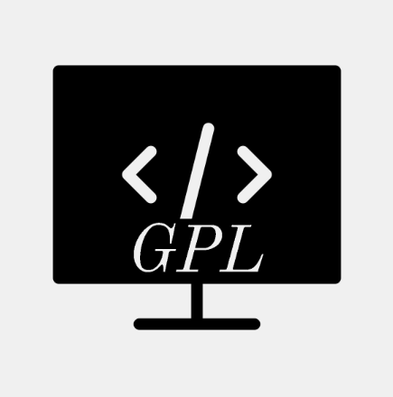
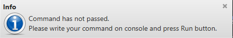
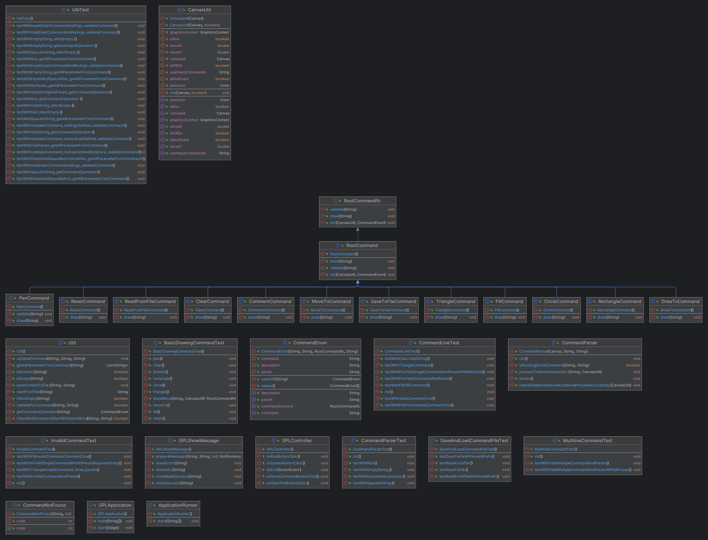

#  Graphical Programming Language Application
<p float="left">
  
<span>
This application is based on producing a simple programming language and environment to explore them using graphics.
 This application helps new student programmer to explore using graphics.
</span>
</p>


# GPL Desktop View


1. Multiple Line Program textarea:
   This section allows develope to write multiline code at once's to perform display operation.
2. Output Display:
   This section display all the output as per the given command or instruction on section 1 or 3.
3. Single Line Command text field:
   This section allows developer to write single line code to perform display operation.
4. Run button:
   This button run the command or program given on section 1 and 3 and display output on output box. This also validate syntax of the programming.
   And this application always give priority to section 3 (single line code first) and if there is no single line code then it will go for section 1 (multiline code program).
5. Syntax button:
   This button checks all syntax error and compile program.

Every event occured within this application has alert message on top right section of the screen for better understanding of event.


# Language Used To Develope
With the wide range of language available, I have selected java to develops this application because of my past and future career as  a software engineer in java.

# Technologies Used
1. Java - JDK20
2. Maven - used to manage project
3. JavaFX - used for graphical represent of the application

# To Run Standalone Jar File
We need these below library to run GPL jar file. So, if not configure in your system please download and install these library along with environment variable config of the system.
1. JRE 20
2. JAVAFX

# Run Instruction
Open your command prompt on this application folder and run below command to access application.
```
    java -jar app\gplapplication-1.0.jar
```

# Basic Overview On Available Command

| S.N | Command                      | Description                                                                                                              |
|-----|------------------------------|--------------------------------------------------------------------------------------------------------------------------|
| 1   | saveToFile \<filepath>       | This command save program to a filepath as given in parameter. filepath should be absolute path (i.e. c:/abc/abc.txt).   |
| 2   | readFromFile \<filepath>     | This command read program from a given filepath and execute.                                                             |
| 3   | moveTo \<x>,\<y>             | This command move the pen or cursor to the given x and y axis.                                                           |
| 4   | circle \<radius>             | This command draw a circle with a given radius.                                                                          |
| 5   | rectangle \<width>,\<height> | This command draw a rectangle with given width and height.                                                               |
| 6   | triangle \<base>,\<adjacent> | This command draw a triangle with given base and adjacent.                                                               |
| 7   | drawTo \<x>,\<y>             | This command draw a line to particular x and y axis from the pen position.                                               |
| 8   | //                           | This command is comment purpose to ignore some code from execution like other programming language.                      |
| 9   | clear                        | This command clear the output box but does not move pen position or reset pen color.                                     |
| 10  | reset                        | This command trigger the clear command along with reset all set parameter i.e pen position or pen color and others.      |
| 11  | pen \<color>                 | This command set the pen color to draw any shape and by default black is set. Values accepted are all valid color names. |
| 12  | fill \<boolean>              | This command fill the shape if set true. Values accepted are true,false.                                                 |

# Sample Command For Testing Basic Operation
```
	clear
	pen red
	moveTo 5,5
	rectangle 150,100
	pen gray
	moveTo 150,100
	circle 50
	pen yellow
	moveTo 50, 50
	fill on
	triangle 100,100
	
	//few more command
	fill off
	pen blue
	moveto 0, 200
	rectangle 80,80
	circle 80
	moveto 25,205
	triangle 50,50
```

# Code Documentation File
 you will find
 <a href="https://github.com/nrynjoshi/AES_GPL/blob/main/README.md">code documentation file link</a>.
 
# Class Diagram 
